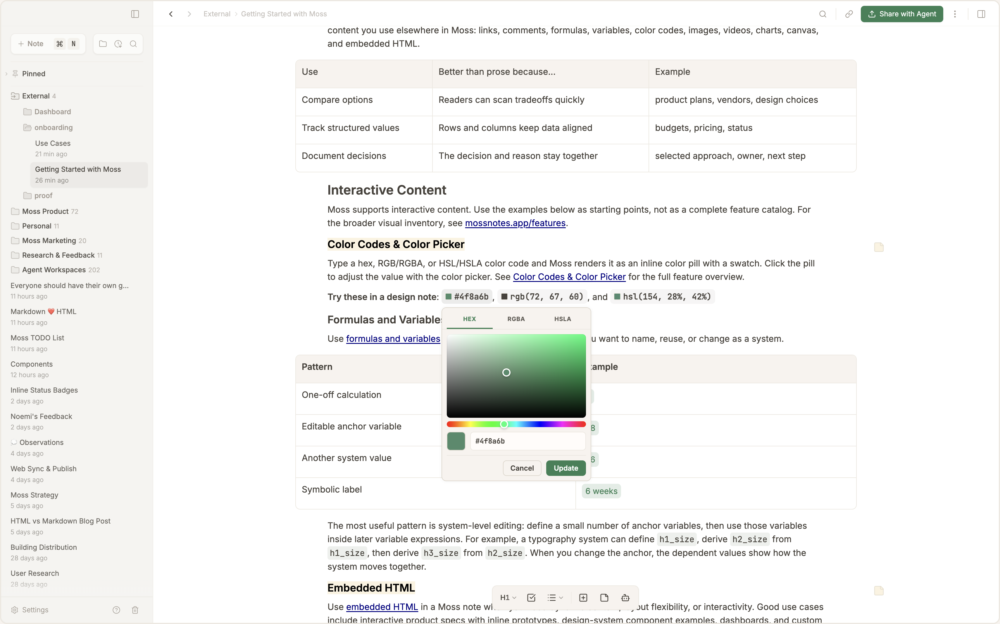
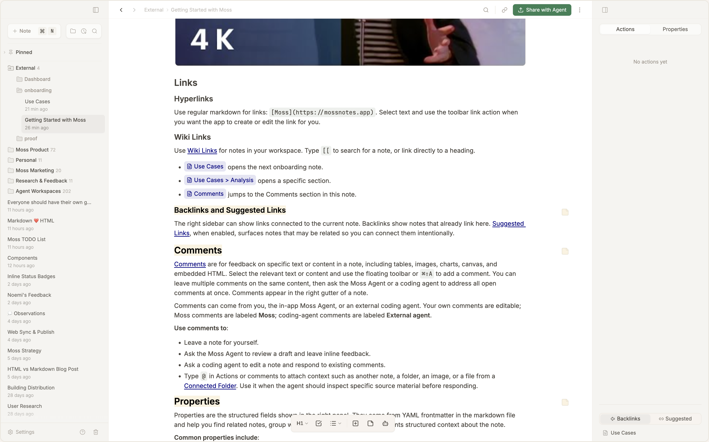
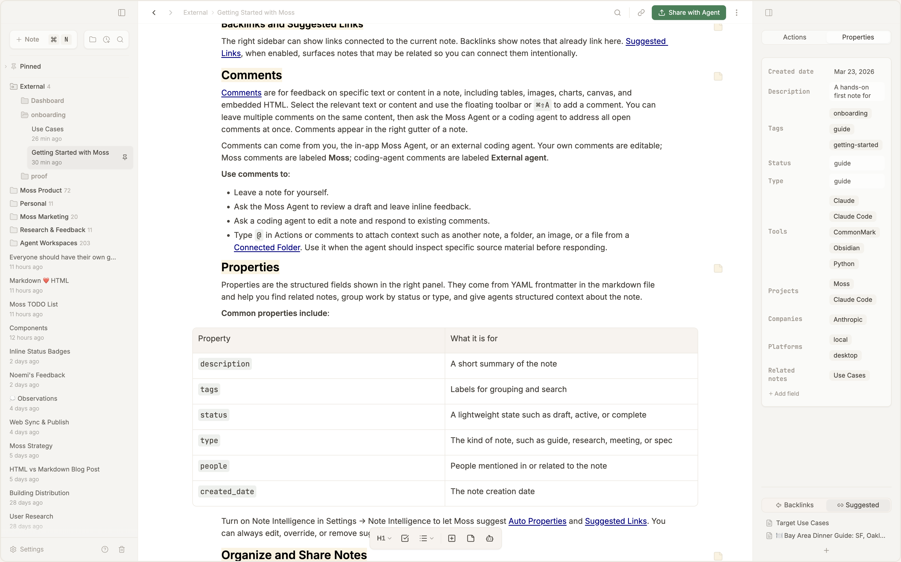
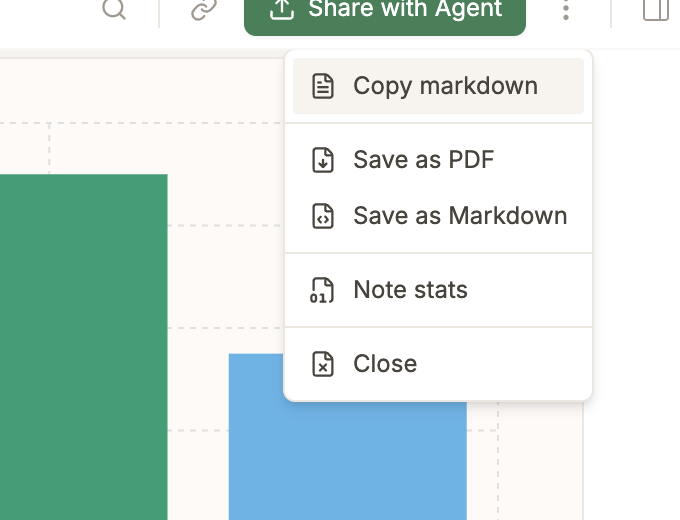
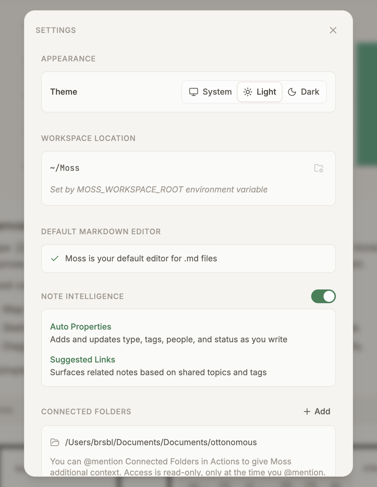
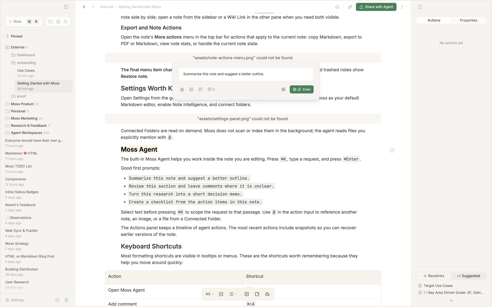

# Getting Started with Moss

Moss is a local-first notes app with rich editing, comments, interactive content types, and embedded AI. Use this note to try core editing features and understand how Moss works.

> For information on how to use Moss across different workflows, such as writing product specs, research, analysis, and design system documentation, see [[Use Cases|f2745aa0-f394-4469-963d-438f2dd9fd5a]]. For a broader visual product tour, use [mossnotes.app/features](https://mossnotes.app/features).

## 👉 Start Here

You can use Moss in two complementary ways:

| ​                                 | Best for                                                                                                                                                                                                  | Try this first                                                                                                |
| --------------------------------- | --------------------------------------------------------------------------------------------------------------------------------------------------------------------------------------------------------- | ------------------------------------------------------------------------------------------------------------- |
| **Built-in Moss Agent**           | Researching, writing, analysis, release planning, and other work inside Moss                                                                                                                              | Press `⌘K`, ask a question about this note, or ask it to leave comments on a section.                         |
| **Coding agents writing to Moss** | Letting Claude Code, Codex, Gemini, or another coding agent create and edit Moss notes as part of a project or knowledge base, such as plans, specs, codebase documentation, or structured review reports | Click **Share with Agent** in the note toolbar, then paste the generated instructions into your coding agent. |

**Comments** are a core way to give and receive feedback in Moss notes. Comments are accessible regardless of whether you use the in-app agent or a coding agent. See [[#Comments]] for more information about comments.

**Share with Agent** is the main way to hand off a Moss note to coding agents. Pressing this button copies the active note path and a pointer to Moss skill files at `~/Moss/.moss/skills/`. If you want a coding agent to load Moss skills automatically in future sessions, install them from [GitHub](https://github.com/brsbl/moss-skills).

## How Notes Are Saved

Your workspace lives at `~/Moss/`, and regular notes live under `~/Moss/Notes/`. A Moss note is a folder, usually shaped like this:

```plaintext
~/Moss/Notes/Example Note/
  Example Note.md
  meta.json
  comments.json        # created when the note has comments
  assets/              # images, videos, screenshots, HTML previews, and local media
```

The `.md` file is the source of your note content. Moss may also create app-owned sidecars for comments, note metadata, cached previews, or other local UI state. You can move, back up, and edit your markdown files, but do not hand-edit app-owned sidecars.

Moss notes use standard markdown plus Moss-specific blocks for things like charts, formulas, canvas, HTML, and comments. Markdown stays readable in any text editor; Moss renders the interactive parts when you open the note in the app.

## Write and Edit

Start with normal writing. Select text to reveal the floating toolbar for bold, italic, strikethrough, highlight, headings, lists, insert actions, and comments.

- **Bold text** for emphasis
- _Italic text_ for softer emphasis
- ~~Strikethrough~~ for removed ideas
- <mark data-color="yellow">Highlighted text</mark> for important phrases
- <u>Underlined text</u> when you need a/nother emphasis style
- `Inline code` for commands, filenames, variables, or technical terms

Links work like regular markdown: [Moss](https://mossnotes.app). For links between notes, see [[#Links]].

### Headings and Quotes

Use headings to structure a note. This section is an `h3`; the major sections are `h2` headings. Start a line with `>` or type `/quote` for a blockquote:

> A blockquote is useful for a short excerpt, decision, or callout that should stand apart from the surrounding text.

### Lists and Checklists

Use lists for lightweight structure and checklists for work you can tick off.

- Draft the note
- Add examples
- Review with comments

* [x] Read the start section
* [ ] Add a comment to this note
* [ ] Try `⌘K` with a selected paragraph

### Code Blocks

Type `/code` to insert a code block. Choose the language and theme from the block controls. If Moss does not support a language you need, request it at [mossnotes.app/support](https://mossnotes.app/support).

```python
def summarize_tasks(tasks: list[str]) -> str:
    return f"{len(tasks)} tasks ready to review"
```

**Agents can also create ASCII diagrams for UI proposals as plain text code blocks**:

```plaintext
Current toolbar:
┌──────────────────────────────────────────────────────────────────┐
│  # My Note                    [⚡ Share with Agent]  [⋯]  [☆]  │
└──────────────────────────────────────────────────────────────────┘

Proposed toolbar (icon-only):
┌──────────────────────────────────────────────────────────────────┐
│  # My Note                                    [↗]  [⋯]  [☆]   │
└──────────────────────────────────────────────────────────────────┘
                                                 ▲
                                          tooltip: "Share with Agent"

On click → toast:
┌──────────────────────────────────────────┐
│  ✓ Agent path copied to clipboard        │
│  ~/Moss/Notes/My Note/My Note.md         │
└──────────────────────────────────────────┘
```

### Tables

Use tables when comparison matters more than prose. Keep them small enough to scan. Tables can include the same content you use elsewhere in Moss: links, comments, formulas, variables, color codes, images, videos, charts, canvas, and embedded HTML.

| Use                     | Better than prose because...          | Example                                |
| ----------------------- | ------------------------------------- | -------------------------------------- |
| Compare options         | Readers can scan tradeoffs quickly    | product plans, vendors, design choices |
| Track structured values | Rows and columns keep data aligned    | budgets, pricing, status               |
| Document decisions      | The decision and reason stay together | selected approach, owner, next step    |

## Interactive Content

Moss supports interactive content. Use the examples below as starting points, not as a complete feature catalog. For the broader visual inventory, see [mossnotes.app/features](https://mossnotes.app/features).

### Color Codes & Color Picker

Type a hex, RGB/RGBA, or HSL/HSLA color code and Moss renders it as an inline color pill with a swatch. Click the pill to adjust the value with the color picker. See [Color Codes & Color Picker](https://mossnotes.app/features#color-previews) for the full feature overview.

**Try these in a design note**: #4f8a6b, rgb(72, 67, 60), and hsl(154, 28%, 42%)



### Formulas and Variables

Use [formulas and variables](https://mossnotes.app/features#formulas) for quick calculations and values you want to name, reuse, or change as a system.

| **Pattern**              | **Example**                                                                                                                                          |
| ------------------------ | ---------------------------------------------------------------------------------------------------------------------------------------------------- |
| One-off calculation      | {{2+2\|4}}                                                                                                                                           |
| Editable anchor variable | {{28\|28\|id=21acec77-6d60-4c6b-b14c-8bb53ebf3f24;name=h1_size}}                                                                                     |
| Another system value     | {{@(h1_size#a618c388-0d20-4ebe-bcbd-55b9d59094ec#21acec77-6d60-4c6b-b14c-8bb53ebf3f24)*2\|56\|id=17f45327-90d8-4ef6-bc1e-8ef126499b13;name=h2_size}} |
| Symbolic label           | {{timeline\|6 weeks\|id=8b4d65a6-a72d-4574-8253-01b6b42a7349}}                                                                                       |

The most useful pattern is system-level editing: define a small number of anchor variables, then use those variables inside later variable expressions. For example, a typography system can define `h1_size`, derive `h2_size` from the same scale, then derive `h3_size` from the next step down. When you change the anchor, the dependent values show how the system moves together.

### Embedded HTML

Use [embedded HTML](https://mossnotes.app/features#html-blocks) when a note needs behavior, layout fidelity, or a small prototype that people can click before the team commits to a design. The example below switches review stages and toggles handoff details, which is the kind of interactive state that fits HTML better than a static screenshot, chart, or canvas sketch.

```moss-html
<!DOCTYPE html>
<html lang="en">
<head>
<meta charset="utf-8">
<meta name="viewport" content="width=device-width, initial-scale=1">
<meta name="moss-html-version" content="v1">
<title>Review handoff prototype</title>
<style>
  * { box-sizing: border-box; }
  html { background: rgb(253, 250, 246); }
  body {
    margin: 0;
    width: 860px;
    min-height: 520px;
    padding: 28px;
    background: rgb(253, 250, 246);
    color: rgb(72, 67, 60);
    font-family: ui-sans-serif, system-ui, -apple-system, BlinkMacSystemFont, "Segoe UI", sans-serif;
  }
  .shell {
    display: grid;
    grid-template-columns: 280px 1fr;
    gap: 18px;
    min-height: 464px;
  }
  .panel {
    border: 1px solid rgb(222, 211, 196);
    border-radius: 8px;
    background: rgb(255, 253, 249);
    box-shadow: 0 14px 30px rgba(72, 67, 60, 0.08);
  }
  .controls { padding: 20px; }
  h1, h2, p { margin: 0; }
  h1 { font-size: 22px; line-height: 1.2; }
  h2 { font-size: 15px; line-height: 1.3; }
  p { color: rgb(112, 103, 94); line-height: 1.5; }
  .eyebrow {
    margin-bottom: 8px;
    color: rgb(47, 95, 66);
    font-size: 12px;
    font-weight: 700;
    letter-spacing: 0;
    text-transform: uppercase;
  }
  .intro { margin-top: 8px; font-size: 14px; }
  .stage-list {
    display: grid;
    gap: 8px;
    margin-top: 22px;
  }
  .stage {
    width: 100%;
    border: 1px solid rgb(222, 211, 196);
    border-radius: 8px;
    background: rgb(250, 247, 242);
    color: rgb(72, 67, 60);
    padding: 11px 12px;
    text-align: left;
    font: inherit;
    cursor: pointer;
  }
  label,
  input[type="checkbox"] {
    cursor: pointer;
  }
  .stage[aria-pressed="true"] {
    border-color: rgb(47, 95, 66);
    background: rgb(239, 247, 241);
    color: rgb(37, 82, 56);
    box-shadow: inset 0 0 0 1px rgba(47, 95, 66, 0.24);
  }
  .stage strong { display: block; font-size: 14px; }
  .stage span { display: block; margin-top: 3px; color: rgb(112, 103, 94); font-size: 12px; }
  .options {
    display: grid;
    gap: 9px;
    margin-top: 20px;
    padding-top: 18px;
    border-top: 1px solid rgb(235, 226, 215);
  }
  label {
    display: flex;
    align-items: flex-start;
    gap: 9px;
    color: rgb(72, 67, 60);
    font-size: 13px;
    line-height: 1.35;
  }
  input[type="checkbox"] {
    width: 16px;
    height: 16px;
    margin-top: 1px;
    accent-color: rgb(47, 95, 66);
  }
  .preview {
    display: grid;
    grid-template-rows: auto 1fr auto;
    overflow: hidden;
  }
  .topbar {
    display: flex;
    align-items: flex-start;
    justify-content: space-between;
    gap: 16px;
    padding: 20px 22px;
    border-bottom: 1px solid rgb(235, 226, 215);
  }
  .status {
    border-radius: 999px;
    background: rgb(226, 238, 229);
    color: rgb(44, 94, 64);
    padding: 7px 10px;
    font-size: 12px;
    font-weight: 700;
    white-space: nowrap;
  }
  .workarea {
    display: grid;
    grid-template-columns: 1.1fr 0.9fr;
    gap: 14px;
    padding: 18px 22px;
  }
  .note-card, .timeline {
    border: 1px solid rgb(235, 226, 215);
    border-radius: 8px;
    background: rgb(250, 247, 242);
    padding: 16px;
  }
  .note-card h2, .timeline h2 { margin-bottom: 10px; }
  .summary {
    min-height: 86px;
    border-radius: 8px;
    background: rgb(255, 253, 249);
    padding: 12px;
    color: rgb(72, 67, 60);
    font-size: 14px;
    line-height: 1.45;
  }
  .checklist {
    display: grid;
    gap: 8px;
    margin-top: 12px;
  }
  .check {
    display: flex;
    align-items: center;
    gap: 8px;
    color: rgb(82, 75, 67);
    font-size: 13px;
  }
  .dot {
    width: 8px;
    height: 8px;
    border-radius: 50%;
    background: rgb(47, 95, 66);
  }
  .timeline ol {
    display: grid;
    gap: 10px;
    margin: 0;
    padding: 0;
    list-style: none;
  }
  .timeline li {
    display: grid;
    grid-template-columns: 22px 1fr;
    gap: 8px;
    align-items: start;
    color: rgb(82, 75, 67);
    font-size: 13px;
    line-height: 1.35;
  }
  .num {
    display: inline-grid;
    place-items: center;
    width: 22px;
    height: 22px;
    border-radius: 50%;
    background: rgb(47, 95, 66);
    color: white;
    font-size: 12px;
    font-weight: 700;
  }
  .footer {
    display: flex;
    justify-content: space-between;
    gap: 12px;
    padding: 14px 22px 20px;
    border-top: 1px solid rgb(235, 226, 215);
    color: rgb(112, 103, 94);
    font-size: 12px;
  }
  .footer strong { color: rgb(47, 95, 66); }
</style>
</head>
<body>
<main class="shell" aria-label="Review handoff prototype">
    <section class="panel controls" aria-label="Prototype controls">
      <div class="eyebrow">Clickable spec</div>
      <h1>Review handoff</h1>
      <p class="intro">Switch the stage and options to preview how a note handoff should behave.</p>

      <div class="stage-list" aria-label="Review stage">
        <button type="button" class="stage" data-stage="intake" aria-pressed="true">
          <strong>Intake</strong>
          <span>Collect goals and source material.</span>
        </button>
        <button type="button" class="stage" data-stage="review" aria-pressed="false">
          <strong>Review</strong>
          <span>Ask Moss to find gaps and leave comments.</span>
        </button>
        <button type="button" class="stage" data-stage="handoff" aria-pressed="false">
          <strong>Handoff</strong>
          <span>Prepare the note for a coding agent.</span>
        </button>
      </div>

      <div class="options" aria-label="Handoff options">
        <label><input type="checkbox" data-option="owner" checked> Require an owner before handoff</label>
        <label><input type="checkbox" data-option="agent" checked> Include the Moss Agent summary</label>
        <label><input type="checkbox" data-option="blocker"> Show unresolved blocker banner</label>
      </div>
    </section>

    <section class="panel preview" aria-live="polite" aria-label="Prototype preview">
      <div class="topbar">
        <div>
          <div class="eyebrow" id="stage-label">Intake</div>
          <h1 id="preview-title">Gather source context</h1>
        </div>
        <span class="status" id="status-label">Draft</span>
      </div>

      <div class="workarea">
        <div class="note-card">
          <h2>Note state</h2>
          <p class="summary" id="summary">The note is collecting source links, goals, constraints, and open questions before review starts.</p>
          <div class="checklist" id="checklist"></div>
        </div>

        <div class="timeline">
          <h2>Handoff flow</h2>
          <ol id="timeline"></ol>
        </div>
      </div>

      <div class="footer">
        <span id="footer-left"><strong>Next:</strong> add context links</span>
        <span id="footer-right">0 blockers</span>
      </div>
    </section>
  </main>

<script>
  document.addEventListener('DOMContentLoaded', () => {
    const stages = {
      intake: {
        label: 'Intake',
        title: 'Gather source context',
        status: 'Draft',
        summary: 'The note is collecting source links, goals, constraints, and open questions before review starts.',
        next: 'add context links',
        steps: ['Create note outline', 'Attach source material', 'Write open questions']
      },
      review: {
        label: 'Review',
        title: 'Review with Moss',
        status: 'In review',
        summary: 'Moss checks the draft, leaves targeted comments, and summarizes what needs attention before implementation.',
        next: 'resolve comments',
        steps: ['Run Moss review', 'Open comment threads', 'Revise unclear sections']
      },
      handoff: {
        label: 'Handoff',
        title: 'Ready for agent work',
        status: 'Ready',
        summary: 'The note has enough context for a coding agent to pick up the task and report back with changes.',
        next: 'share with agent',
        steps: ['Confirm owner', 'Include Moss summary', 'Send to coding agent']
      }
    };

    let activeStage = 'intake';
    const stageButtons = Array.from(document.querySelectorAll('.stage'));
    const optionInputs = Array.from(document.querySelectorAll('[data-option]'));
    const nodes = {
      stageLabel: document.getElementById('stage-label'),
      title: document.getElementById('preview-title'),
      status: document.getElementById('status-label'),
      summary: document.getElementById('summary'),
      checklist: document.getElementById('checklist'),
      timeline: document.getElementById('timeline'),
      footerLeft: document.getElementById('footer-left'),
      footerRight: document.getElementById('footer-right')
    };

    function optionEnabled(name) {
      const input = optionInputs.find((item) => item.dataset.option === name);
      return Boolean(input && input.checked);
    }

    function render() {
      const stage = stages[activeStage];
      const hasOwner = optionEnabled('owner');
      const hasAgent = optionEnabled('agent');
      const hasBlocker = optionEnabled('blocker');
      nodes.stageLabel.textContent = stage.label;
      nodes.title.textContent = stage.title;
      nodes.status.textContent = hasBlocker ? 'Blocked' : stage.status;
      nodes.summary.textContent = hasBlocker
        ? stage.summary + ' A blocker banner is visible so the handoff cannot be mistaken for ready.'
        : stage.summary;
      nodes.footerLeft.innerHTML = '<strong>Next:</strong> ' + stage.next;
      nodes.footerRight.textContent = hasBlocker ? '1 blocker' : '0 blockers';

      const checks = [
        hasOwner ? 'Owner is required' : 'Owner is optional',
        hasAgent ? 'Moss summary is included' : 'Moss summary is hidden',
        hasBlocker ? 'Blocker banner is active' : 'No unresolved blockers'
      ];
      nodes.checklist.innerHTML = checks.map((text) => '<div class="check"><span class="dot"></span><span>' + text + '</span></div>').join('');
      nodes.timeline.innerHTML = stage.steps.map((text, index) => '<li><span class="num">' + (index + 1) + '</span><span>' + text + '</span></li>').join('');

      stageButtons.forEach((button) => {
        button.setAttribute('aria-pressed', String(button.dataset.stage === activeStage));
      });
    }

    stageButtons.forEach((button) => {
      button.addEventListener('click', () => {
        activeStage = button.dataset.stage || 'intake';
        render();
      });
    });
    optionInputs.forEach((input) => input.addEventListener('change', render));
    render();
  });
</script>
</body>
</html>
```

### Charts

Type `/chart` to insert a [chart](https://mossnotes.app/features#charts). Charts can be bar, line, area, or stacked bar. Select a chart to edit its data, change the chart type, rename the title, or switch the chart theme.

%%m:onboarding-block-chart-comment:start%%

```moss-chart
{
  "type": "line",
  "title": "Review Loop Throughput",
  "data": [
    {
      "label": "Week 1",
      "value": 12
    },
    {
      "label": "Week 2",
      "value": 18
    },
    {
      "label": "Week 3",
      "value": 16
    },
    {
      "label": "Week 4",
      "value": 24
    }
  ],
  "series": [
    {
      "name": "Drafts opened",
      "data": [
        {
          "label": "Week 1",
          "value": 12
        },
        {
          "label": "Week 2",
          "value": 18
        },
        {
          "label": "Week 3",
          "value": 16
        },
        {
          "label": "Week 4",
          "value": 24
        }
      ]
    },
    {
      "name": "Agent reviews",
      "data": [
        {
          "label": "Week 1",
          "value": 8
        },
        {
          "label": "Week 2",
          "value": 14
        },
        {
          "label": "Week 3",
          "value": 19
        },
        {
          "label": "Week 4",
          "value": 21
        }
      ]
    },
    {
      "name": "Comments resolved",
      "data": [
        {
          "label": "Week 1",
          "value": 5
        },
        {
          "label": "Week 2",
          "value": 11
        },
        {
          "label": "Week 3",
          "value": 17
        },
        {
          "label": "Week 4",
          "value": 23
        }
      ]
    }
  ],
  "options": {
    "height": 300,
    "palette": "accessible",
    "showLegend": true,
    "showGrid": true,
    "yAxisLabel": "Items"
  }
}
```

%%m:onboarding-block-chart-comment:end%%

A stacked bar chart shows a second chart type for comparing the composition of comments by source.

```moss-chart
{
  "type": "stacked-bar",
  "title": "Comment Source Mix",
  "data": [
    {
      "label": "You",
      "value": 4
    },
    {
      "label": "Moss",
      "value": 3
    },
    {
      "label": "External agent",
      "value": 5
    }
  ],
  "options": {
    "height": 240,
    "palette": "mono",
    "showLegend": false
  }
}
```

### Canvas

Type `/canvas` for quick visual sketches like user journeys, rough layouts, and product flows where shape matters more than polished rendering.

**Example**: a planning flow that shows how review comments loop a draft back into revision before handoff.

```moss-canvas
[moss:grid:v2]
[moss:labels:[{"id":"inputs","text":"Collect inputs","col":8,"row":9},{"id":"draft","text":"Draft spec","col":43,"row":9},{"id":"review","text":"Review","col":80,"row":9},{"id":"decision","text":"Clear?","col":83,"row":28},{"id":"comments","text":"Comments","col":13,"row":46},{"id":"revise","text":"Revise","col":45,"row":46},{"id":"handoff","text":"Handoff","col":88,"row":46},{"id":"f23vku","text":"YES","col":102,"row":25},{"id":"5pwntk","text":"NO","col":61,"row":25}]]
........................................................................................................................
........................................................................................................................
........................................................................................................................
........................................................................................................................
....+-------------------------+.......+-------------------------+.......+-------------------------+.....................
....|.........................|.......|.........................|.......|.........................|.....................
....|.........................|....#..|.........................|....#..|.........................|.....................
....|.........................|.....#.|.........................|.....#.|.........................|.....................
....|.........................|......++.........................|......++.........................|.....................
....|.........................+------++.........................+------++.........................|.....................
....|.........................|......++.........................|......++.........................|.....................
....|.........................|.....#.|.........................|.....#.|.........................|.....................
....|.........................|....#..|.........................|....#..|.........................|.....................
....|.........................|.......|.........................|.......|.........................|.....................
....|.........................|.......|.........................|.......|.........................|.....................
....+-------------------------+.......+-----------+++-----------+.......+------------+------------+.....................
..................................................+++................................|..................................
.................................................#.|.#...............................|..................................
................................................#..|..#...........................#..|..#...............................
...............................................#...|...#...........................#.|.#................................
...................................................|................................+++.................................
...................................................|................................+++.................................
...................................................|..............................--...--...............................
...................................................|............................--.......--.............................
...................................................|..........................--...........--...........................
...................................................|........................--...............--.........................
...................................................|......................--...................--.......................
...................................................|....................--.......................--.....................
.................+---------------------------------+--------------------...........................-------+.............
.................|.................................|....................--.......................--.......|.............
.................|.................................|......................--...................--.........|.............
.................|.................................|........................--...............--...........|.............
.................|.................................|..........................--...........--.............|.............
.................|.................................|............................--.......--...............|.............
.................|.................................|..............................--...--.................|.............
.................|.................................|................................---...................|.............
.................|.................................|......................................................|.............
.................|.................................|..................................................#...|...#.........
..............#..|..#..............................|...................................................#..|..#..........
...............#.|.#...............................|....................................................#.|.#...........
................+++................................|.....................................................+++............
.....+----------+++-----------+.......+------------+------------+.................+----------------------+++----+.......
.....|........................|.......|.........................|.................|.............................|.......
.....|........................|....#..|.........................|.................|.............................|.......
.....|........................|.....#.|.........................|.................|.............................|.......
.....|........................|......++.........................|.................|.............................|.......
.....|........................+------++.........................|.................|.............................|.......
.....|........................|......++.........................|.................|.............................|.......
.....|........................|.....#.|.........................|.................|.............................|.......
.....|........................|....#..|.........................|.................|.............................|.......
.....|........................|.......|.........................|.................|.............................|.......
.....|........................|.......|.........................|.................|.............................|.......
.....+------------------------+.......+-------------------------+.................+-----------------------------+.......
........................................................................................................................
........................................................................................................................
........................................................................................................................
........................................................................................................................
........................................................................................................................
........................................................................................................................
........................................................................................................................
```

### Images & Video

Add [images and video](https://mossnotes.app/features#images) with `/media`, by dragging those files into the editor, or by pasting supported media such as a YouTube link.


## Links

### Hyperlinks

Use regular markdown for links: `[Moss](https://mossnotes.app)`. Select text and use the toolbar link action when you want the app to create or edit the link for you.

### Wiki Links

Use [Wiki Links](https://mossnotes.app/features#wiki-links) for notes in your workspace. Type `[[` to search for a note, or link directly to a heading.

- [[Use Cases|f2745aa0-f394-4469-963d-438f2dd9fd5a]] opens the next onboarding note.
- [[Use Cases#Decision-making & Analysis|f2745aa0-f394-4469-963d-438f2dd9fd5a]] opens a specific section.
- [[#Comments]] jumps to the Comments section in this note.

### Backlinks and Related Notes

The right sidebar can show links connected to the current note. Backlinks show notes that already link here. [Related Notes](https://mossnotes.app/features#suggested-links), when enabled, surfaces notes that may be related so you can connect them intentionally.



## Comments

[Comments](https://mossnotes.app/features#comments) are for feedback on exact text, inline elements, table cells, and whole content blocks. Select text to comment on a phrase, or select a block such as an image, chart, canvas, embedded HTML, video, or code block to anchor the comment to the whole object. Comments appear in the right gutter of a note, so the main body stays clean while the discussion remains attached to the relevant content.

Comments can come from you while reviewing your own draft, the in-app Moss Agent, or an external coding agent:

- %%m:onboarding-user-comment:start%%Your own comments stay editable, so you can leave yourself a review note and revise it later.%%m:onboarding-user-comment:end%%
- %%m:onboarding-moss-comment:start%%Moss comments are labeled %%m:onboarding-moss-comment:end%%%%m:onboarding-moss-comment:start%%**Moss**%%m:onboarding-moss-comment:end%%%%m:onboarding-moss-comment:start%% when the in-app agent leaves feedback.%%m:onboarding-moss-comment:end%%
- %%m:onboarding-external-comment:start%%External coding-agent comments are labeled %%m:onboarding-external-comment:end%%%%m:onboarding-external-comment:start%%**External agent**%%m:onboarding-external-comment:end%%%%m:onboarding-external-comment:start%% when a connected agent writes review notes back into Moss.%%m:onboarding-external-comment:end%%

The multi-series chart above also has a block-node comment, which shows how feedback can attach to an entire chart instead of a text selection.

**Use comments to**:

- Leave a note for yourself.
- Ask the Moss Agent to review a draft and leave inline feedback.
- Ask a coding agent to edit a note and respond to existing comments.
- Type `@` in Actions or comments to attach context such as another note, a folder, an image, or a file from a [Connected Folder](https://mossnotes.app/features#connected-folders). Use it when the agent should inspect specific source material before responding.

## Properties

Properties are the structured fields shown in the right panel. They come from YAML frontmatter in the markdown file and help you find related notes, group work by status or type, and give agents structured context about the note.



**Common properties include**:

| Property       | What it is for                                              |
| -------------- | ----------------------------------------------------------- |
| `description`  | A short summary of the note                                 |
| `tags`         | Labels for grouping and search                              |
| `status`       | A lightweight state such as draft, active, or complete      |
| `type`         | The kind of note, such as guide, research, meeting, or spec |
| `people`       | People mentioned in or related to the note                  |
| `created_date` | The note creation date                                      |

Turn on Note Intelligence in Settings → Note Intelligence to let Moss suggest [Default Properties](https://mossnotes.app/features#auto-properties) and [Related Notes](https://mossnotes.app/features#suggested-links). You can always edit, override, or remove suggestions.

## Organize and Share Notes

### Sidebar and Layout

Use the left sidebar to create notes with **`+ Note`**, search your workspace, make folders, pin important notes, and right-click a note to rename, duplicate, move, trash, or copy a link. Use [split view](https://mossnotes.app/features#split-view) when you want a source note and working note side by side; open a note from the sidebar or a Wiki Link in the other pane when you need both visible.

### Export and Note Actions

Open the note's **More actions** menu in the top bar for actions that apply to the current note: copy Markdown, export to PDF or Markdown, view note stats, or handle the current note state.



**The final menu item changes by context**: regular notes show **Trash**, external files show **Close**, and trashed notes show **Restore note**.

## Settings Worth Knowing

Open Settings from the gear in the sidebar to choose a theme, manage workspace location, set Moss as your default Markdown editor, enable Note Intelligence, and connect folders.



Connected Folders are read on demand. Moss does not scan or index them in the background; the agent reads files you explicitly mention with `@`.

## Moss Agent

The built-in Moss Agent helps you work inside the note you are editing. Press `⌘K`, type a request, and press `⌘Enter`.



Good first prompts:

- `Summarize this note and suggest a better outline.`
- `Review this section and leave comments where it is unclear.`
- `Turn this research into a short decision memo.`
- `Create a checklist from the action items in this note.`

Select text before pressing `⌘K` to scope the request to that passage. Use `@` in the action input to reference another note, an image, or a file from a Connected Folder.

The Actions panel keeps a timeline of agent actions. The most recent actions include snapshots so you can recover earlier versions of the note.

## Keyboard Shortcuts

Most formatting shortcuts are visible in tooltips or menus. These are the shortcuts worth remembering because they help you move around quickly:

| Action          | Shortcut |
| --------------- | -------- |
| Open Moss Agent | `⌘K`     |
| Add comment     | `⌘⇧A`    |
| New note        | `⌘N`     |
| Search notes    | `⌘F`     |
| Rename note     | `⌘T`     |
| Notes tab       | `⌘1`     |
| Trash tab       | `⌘2`     |
| Previous note   | `⌘⌥←`    |
| Next note       | `⌘⌥→`    |

## External Markdown Files

Moss can open [markdown files outside your workspace](https://mossnotes.app/features#external-folders), such as Obsidian vaults, project docs, Claude Code plans, or notes in another folder. Changes save back to the original file on disk.

External files stay where they are. Moss does not import or migrate them into your workspace unless you choose to move or copy them yourself.

## What's Next?

Try one workflow from [[Use Cases|f2745aa0-f394-4469-963d-438f2dd9fd5a]], then come back and edit this note. Use [mossnotes.app/features](https://mossnotes.app/features) when you want the broader product tour, screenshots, and feature documentation.
