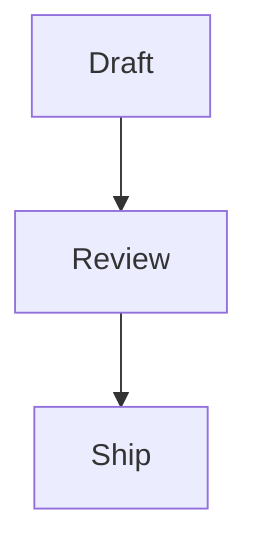

# Kitchen Sink

Every construct the editor models, in one place. Open [[Welcome]] for the front door, or [[Getting Started with Moss|the tour]] for the long version.

A link to a note that does not exist yet renders dashed: [[Field Notes]].

## Marks and inline

**Bold**, _italic_, ~~strikethrough~~, `inline code`, a [link](https://example.com), an inline equation $$a^2+b^2=c^2$$, and a date chip <date value="2026-08-22" /> in prose.

Color literals render as swatches: #4f8a6b, rgb(72, 67, 60), hsl(154, 28%, 42%).

A tag chip: #reference

## Formulas

A one-off calculation {{2+2|4}} beside a named anchor {{16|16|id=3f2a9d10-6c1e-4b7a-8e52-0aa1b2c3d4e5;name=base_size}}.

A bound derivation {{@(base_size#1c9a5b76-4e2d-4f4b-9a63-7e1f2b8c0d44#3f2a9d10-6c1e-4b7a-8e52-0aa1b2c3d4e5)*2|32|id=9b8c7d6e-5f4a-4321-a098-76543210fedc;name=double_size}} follows its anchor.

Money and percent forms: {{$5,000*0.2|$1,000}} and {{50%|0.5}}.

## Lists

- A bulleted list
- With a second item

1. A numbered list
2. In order

- [ ] An open task with a [[Welcome|wiki link]]
- [x] A finished task

## Quote and divider

> A blockquote for a decision worth setting apart.

---

## Table with pills

| Metric  | Value               |
| ------- | ------------------- |
| Monthly | {{1000\|1,000}}     |
| Yearly  | {{1000*12\|12,000}} |

## Code, equation, diagram

```python
def greet(name: str) -> str:
    return f"Hello, {name}"
```

$$
\int_0^1 x^2\,dx = \tfrac{1}{3}
$$



## Toggle and columns

<toggle>
  Hidden until opened.

  - details live here
</toggle>

<column_group>
  <column>
    Left column.
  </column>

  <column>
    Right column.
  </column>
</column_group>

## Callouts

```moss-callout
info
An informational callout with a {{2+2|4}} pill inside.
```

```moss-callout
warning
A warning callout.
```

```moss-callout
priority
high
A priority callout carrying its level.
```

## Tabs

:::tabs
=== First
Content in the first panel, with a [[Welcome]] link.

=== Second
A fence inside a panel:

```ts
const answer = 42;
```
:::

## Chart

```moss-chart
{"type":"bar","title":"Requests","data":[{"label":"Mon","value":12},{"label":"Tue","value":18},{"label":"Wed","value":9}]}
```

```moss-chart
{"type":"line","title":"Latency (ms)","series":[{"name":"p50","data":[{"label":"Mon","value":41},{"label":"Tue","value":38},{"label":"Wed","value":44}]},{"name":"p95","data":[{"label":"Mon","value":120},{"label":"Tue","value":98},{"label":"Wed","value":131}]}]}
```

## Canvas

```moss-canvas
[moss:grid:v2]
{"items":[]}
```

## HTML

```moss-html
<div style="padding:12px;border:1px solid #ddd;border-radius:8px;font-family:sans-serif">
  A sandboxed prototype — press Run to render it.
</div>
```

## Alert

> [!NOTE]
> A GFM alert block.

## Comments

This %%m:seed-open-thread:start%%sentence carries an open comment thread%%m:seed-open-thread:end%% for the panel.

This %%m:seed-resolved-thread:start%%one carries a resolved thread%%m:seed-resolved-thread:end%% that keeps its history.

## Embeds

A note transclusion: ![[Welcome]]

An image from the vault's assets:


