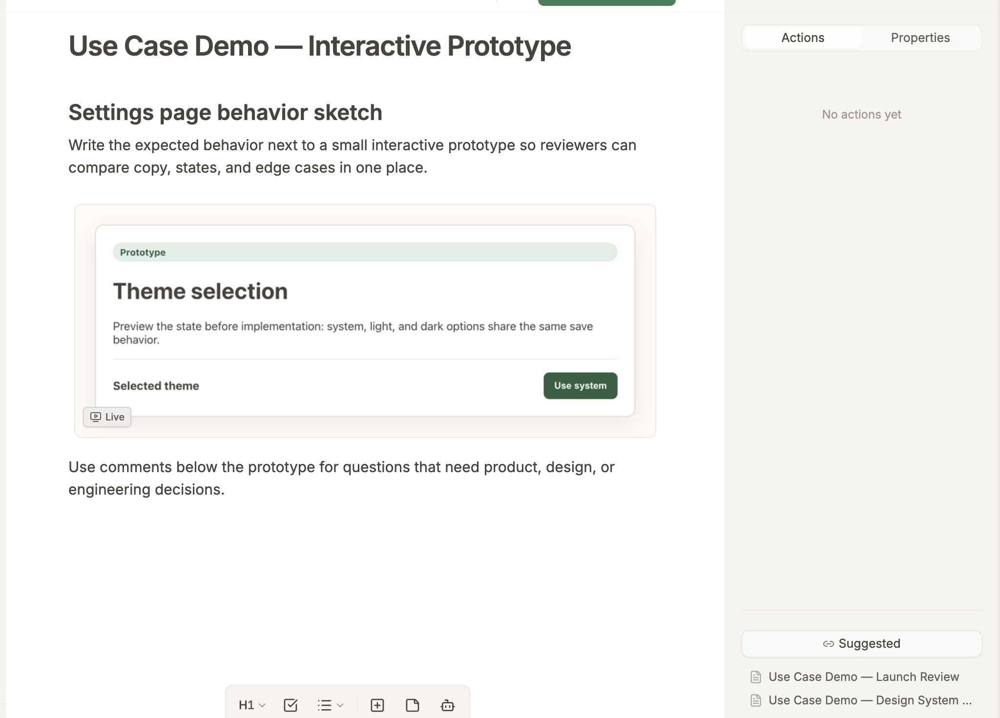
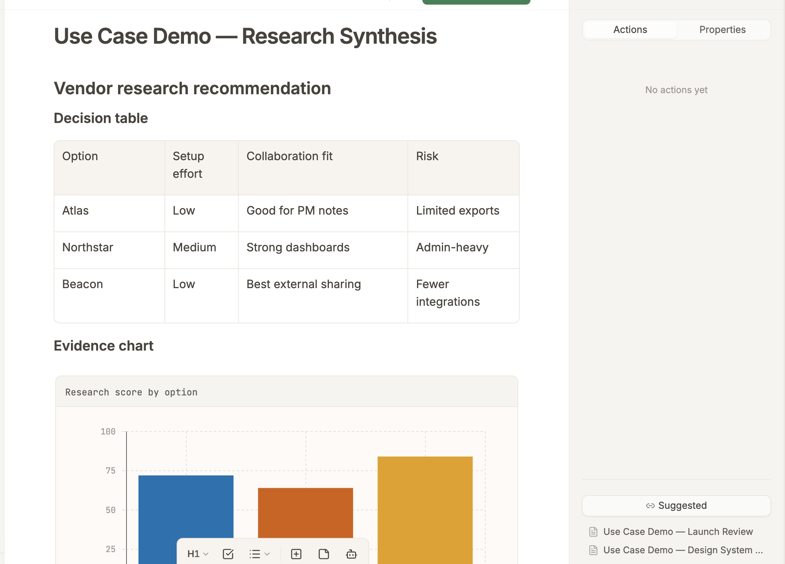
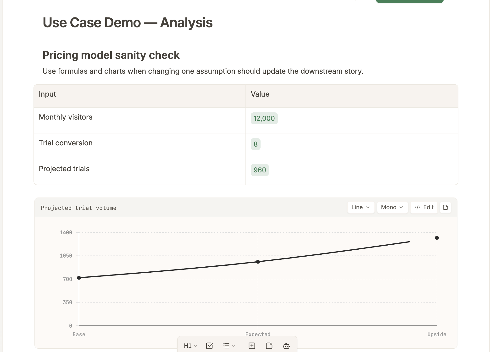
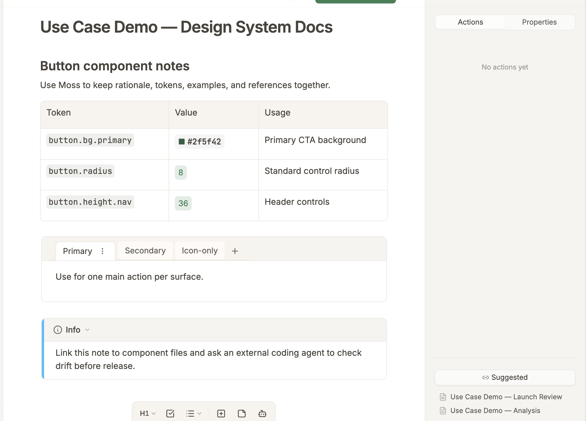
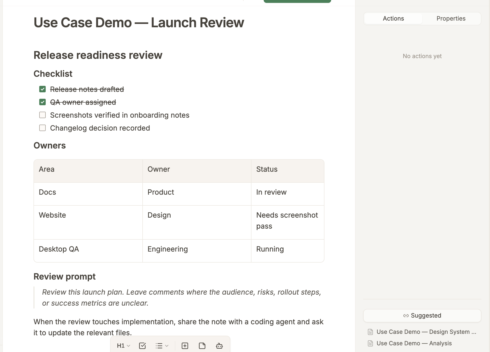

# Use Cases

Use this note when you want to try Moss on real work, not just explore features. Each workflow shows what to create, how to start, where the Moss Agent helps, and when to hand off to an external coding agent.

You can use Moss in two complementary ways:

| Path                       | Use it when                                                                                                                                | How to start                                                                                           |
| -------------------------- | ------------------------------------------------------------------------------------------------------------------------------------------ | ------------------------------------------------------------------------------------------------------ |
| **Moss Agent**             | You want in-app help drafting, researching, reorganizing, or analyzing. Moss Agent is powered by Claude Code.                              | Press `⌘K` in a note, write a focused request, and press `⌘Enter`.                                     |
| **External coding agents** | You want Claude Code, Codex, Cursor, or another agent to work with Moss notes as a knowledge base, usually as part of implementation work. | Click **Share with Agent** in the top nav and paste the generated instructions into your coding agent. |

> For mechanics, examples, and syntax for specific features, see [[Getting Started with Moss|a618c388-0d20-4ebe-bcbd-55b9d59094ec]]. For the full visual feature inventory, use [mossnotes.app/features](https://mossnotes.app/features).

---

## 1️⃣ Interactive Product Specs

Use Moss when an idea needs to become a structured product spec with context, decisions, acceptance criteria, and a lightweight prototype beside the written explanation.

1. **Start in Moss**

Create a feature note. Add the problem, audience, goals, non-goals, user stories, open questions, acceptance criteria, target behavior, and states to test.

2. **Use the Moss Agent**

Ask the Moss Agent to turn rough notes into a spec and prototype plan:

> Draft an interactive product spec from these notes. Add goals, non-goals, user stories, acceptance criteria, open questions, and a small embedded HTML prototype for the core interaction. Leave comments where requirements are ambiguous.

Review the comments and reply in place. Type `@` in Actions or comments to reference notes, folders, or connected files. Upload images when the agent should use a screenshot or visual reference.

3. **Add useful artifacts**

- A [[Getting Started with Moss#Lists and Checklists|checklist]] for launch or implementation readiness.
- A [[Getting Started with Moss#Tables|table]] for requirements, owners, states, and status.
- [[Getting Started with Moss#Embedded HTML|Embedded HTML]] for a focused prototype if behavior is easier to show than describe.
- [[Getting Started with Moss#Color Codes & Color Picker|Color previews]], [[Getting Started with Moss#Formulas and Variables|variables]], or a [[Getting Started with Moss#Canvas|canvas]] when design, sizing, pricing, timing, or interaction details matter.
- [Tabs](https://mossnotes.app/features#tabs) for variants, states, or permissions that belong in one product spec.
- [[Getting Started with Moss#Comments|Comments]] for questions you want product, design, engineering, or an agent to resolve.

4. **Use a coding agent**

When the spec and prototype are ready for implementation, click **Share with Agent**. Ask your coding agent to read the note, implement against the acceptance criteria, and use the embedded HTML as behavior reference unless you explicitly want it copied exactly.

---

## 2️⃣ Research Lifecycle

Use Moss when you need to collect evidence, compare options, and turn research into a recommendation.

1. **Start in Moss**

Create a research note with the decision at the top. Add sections for findings, evidence, tradeoffs, and the recommendation.

2. **Use the Moss Agent**

Ask the Moss Agent for structured research:

> Research three onboarding analytics tools for a B2B SaaS product. Compare pricing, setup effort, collaboration features, and risks. Summarize the recommendation in a decision table.

This pattern also works for trip planning, vendor research, school research, or any decision with multiple options.

3. **Add useful artifacts**

- A comparison table for options and tradeoffs.
- Comments on claims that need verification, or work for the Moss agent to do.
- Links to supporting notes or sources.
- Tabs for alternate audiences, options, or evidence sets that share the same context.
- A chart if the decision depends on numbers.

4. **Use a coding agent**

When research depends on many files, exported data, or code, share the Moss note. Ask the coding agent to analyze the source material and write findings back into the same note or a linked follow-up note.

---

## 3️⃣ Decision-making & Analysis

Use Moss when a decision depends on assumptions, calculations, comparisons, scenarios, or tradeoffs that need to stay visible.

1. **Start in Moss**

Write the decision question first. For example: “Which pricing tier should we test?” or “What changes if token sizes increase by 2px?”

2. **Use the Moss Agent**

Ask the Moss Agent to set up the model:

> Build a pricing analysis for three SaaS tiers. Define the assumptions, create variables for conversion and user volume, calculate projected revenue, and add a chart comparing scenarios.

3. **Add useful artifacts**

- Variables for assumptions you expect to change.
- Formulas that reference those variables so the model updates together.
- Tables for scenarios.
- Tabs for base, optimistic, and conservative cases.
- Charts for comparisons.
- Comments for assumptions that need validation.

Use the same pattern for product pricing, budget planning, launch forecasting, feature scoring, design-token systems, or any decision where one input should update downstream values.

4. **Use a coding agent**

When analysis depends on exported data, scripts, logs, or code, share the note. Ask the coding agent to compute the results and write the explanation, tables, and charts back into Moss.

---

## 4️⃣ Design & Codebase Docs

Use Moss when you need documentation that combines rationale, examples, tokens, codebase context, and visual references.

1. **Start in Moss**

Create a note for the component, pattern, or foundation. Put the decision and usage guidance before detailed tokens or implementation notes.

2. **Use the Moss Agent**

Ask the Moss Agent for a structured documentation page:

> Draft design and codebase documentation for our button component. Include when to use it, variants, states, accessibility notes, token references, implementation notes, and examples.

3. **Add useful artifacts**

- Color previews with swatches for token values.
- Variables for token values that should move as a system.
- Tables for variants, states, and usage rules.
- Tabs for component variants, states, or platform examples.
- Small embedded HTML examples for visual previews.
- Canvas blocks for flows or composition sketches.
- Wiki Links to related foundation, component, or pattern notes.

4. **Use a coding agent**

When the documentation must stay aligned with a codebase, share the note. Ask the coding agent to compare it with component files, design-token files, or tests, then update the note with mismatches and suggested fixes.

---

## 5️⃣ Launch & Release Review

Use Moss when a draft, release, or handoff needs structured review before it becomes public or shipped.

1. **Start in Moss**

Create a launch or review note with a short summary, decision owner, checklist, risks, and open questions.

2. **Use the Moss Agent**

Ask the Moss Agent for a critique:

> Review this launch plan. Leave comments where the audience, risks, rollout steps, or success metrics are unclear.

Work through the comments in the right gutter.

3. **Add useful artifacts**

- Checklists for launch readiness.
- Comments for required decisions.
- Tables for owners, dates, and status.
- Wiki Links to specs, research, release notes, and design docs.
- Charts or formulas if you are tracking metrics or thresholds.

4. **Use a coding agent**

When the review touches implementation, release notes, QA, or docs, share the note. Ask the coding agent to update the relevant files and summarize what changed back in Moss.

---

## Combine Workflows

Most real work uses more than one pattern. A product idea might start as research, become a spec with an embedded prototype, feed a coding agent for implementation, and turn into a launch checklist. Use this note to pick the workflow shape, then use [[Getting Started with Moss|a618c388-0d20-4ebe-bcbd-55b9d59094ec]] when you need mechanics for a specific Moss feature.
